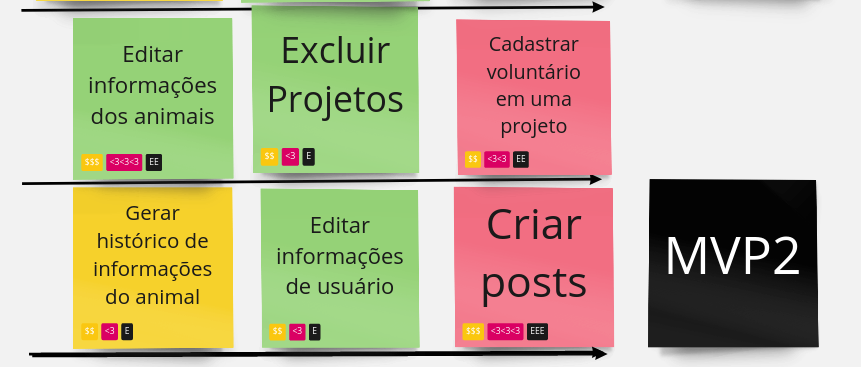

# Histórico de Versão

|    Data    | Versão |                Descrição                 |            Autor(es)            |
| :--------: | :----: | :--------------------------------------: | :-----------------------------: |
| 09/08/2022 |  0.1   |           Criação do documento           | Pedro Helias, Gabriel Marcolino |
| 16/08/2022 |  0.2   | Adicionando histórias de usuário do MVP1 |        Gabriel Marcolino        |
| 08/09/2022 |  0.3   | Adicionando histórias de usuário do MVP2 |        Gabriel Marcolino        |

## **MVP 1**

O MVP 1 será composto pelas seguintes funcionalidades.

### **US01**

|          US01 | Logar usuário na plataforma                                                                                     |
| ------------: | :-------------------------------------------------------------------------------------------------------------- |
|     **Épico** | Sessão do Usuário                                                                                               |
|   **Feature** | Acesso/Login a plataforma                                                                                       |
| **Descrição** | **Eu como** dono do projeto **quero** acessar a plataforma usando a conta criada **para** começar a usar o site |

### **US08**

|          US08 | Editar informações do projeto                                                                                    |
| ------------: | :--------------------------------------------------------------------------------------------------------------- |
|     **Épico** | Sessão do Usuário                                                                                                |
|   **Feature** | Gerenciamento de conta                                                                                           |
| **Descrição** | **Eu como** dono do projeto **quero** editar as informações do projeto **para** manter as infomaçẽos ataulizadas |

### **US09**

|          US09 | Cadastrar um projeto                                                                                                       |
| ------------: | :------------------------------------------------------------------------------------------------------------------------- |
|     **Épico** | Sessão do Usuário                                                                                                          |
|   **Feature** | Gerenciamento de conta                                                                                                     |
| **Descrição** | **Eu como** dono do projeto **quero** realizar o cadastro de um projeto para ter mais controle de gerenciamento e recursos |

### **US13**

|          US13 | Realizar cadastro do animal                                                                                              |
| ------------: | :----------------------------------------------------------------------------------------------------------------------- |
|     **Épico** | Interatividade com o sistema                                                                                             |
|   **Feature** | Gerenciamento de cadastro de animal                                                                                      |
| **Descrição** | **Eu como** dono do projeto **quero** realizar o cadastro do animal **para** facilitar a busca dos usuários para adoções |

### **US15**

|          US15 | Exibir animais disponíveis para adoção                                                                                   |
| ------------: | :----------------------------------------------------------------------------------------------------------------------- |
|     **Épico** | Interatividade com o sistema                                                                                             |
|   **Feature** | Gerenciamento de cadastro de animal                                                                                      |
| **Descrição** | **Eu como** tutor **quero** quero ver quais animais estão disponíveis para adoção **para** ter mais liberdade de escolha |

### **US25**

|          US25 | Pesquisar por projetos                                                                                    |
| ------------: | :-------------------------------------------------------------------------------------------------------- |
|     **Épico** | Interatividade com o sistema                                                                              |
|   **Feature** | Interação entre usuários                                                                                  |
| **Descrição** | **Eu como** tutor **quero** pesquisar por outros projetos **para** buscar o mesmo serviço ou oportunidade |

## **MVP 2**

O MVP 2 será composto pelas seguintes funcionalidades.

### US18

|          US18 | Realizar a edição de informações do animal                                                                                                        |
| ------------: | :------------------------------------------------------------------------------------------------------------------------------------------------ |
|     **Épico** | Interatividade com o sistema                                                                                                                      |
|   **Feature** | Gerenciamento de cadastro de animais                                                                                                              |
| **Descrição** | **Eu como** dono do projeto **quero** realizar edição de informações do animal **para** ter maior controle sobre os animais vinculados ao projeto |

### US07

|          US07 | Excluir projeto                                                                                  |
| ------------: | :----------------------------------------------------------------------------------------------- |
|     **Épico** | Sessão do Usuário                                                                                |
|   **Feature** | Gerenciamento de conta                                                                           |
| **Descrição** | **Eu como** dono do projeto **quero** excluir projeto **para** adequar ao estado atualdo projeto |

### US22

|          US22 | Cadastrar dados para candidatura a adoção |
| ------------: | :---------------------------------------- |
|     **Épico** | Interatividade com o sistema              |
|   **Feature** | Interação entre usuário                   |
| **Descrição** | **Eu como**  **quero** **para**           |

### US14

|          US14 | Gerar histórico do animal                                                                                          |
| ------------: | :----------------------------------------------------------------------------------------------------------------- |
|     **Épico** | Interatividade com o sistema                                                                                       |
|   **Feature** | Gerenciamento de cadastro de animais                                                                               |
| **Descrição** | **Eu como** dono do projeto **quero** gerar histórico do animal **para** facilitar processos documentais de adoção |

### US06

|          US06 | Editar dados pessoais                                                                         |
| ------------: | :-------------------------------------------------------------------------------------------- |
|     **Épico** | Acesso/Login a Plataforma                                                                     |
|   **Feature** | Gerenciamento de conta                                                                        |
| **Descrição** | **Eu como** tutor **quero** editar meus dados pessoais **para** atualizar meus dados recentes |

