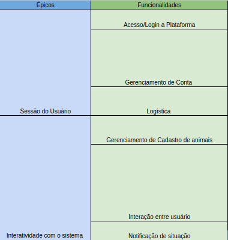
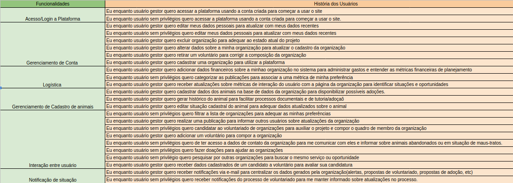

# Backlog

## Histórico de Versão

|    Data    | Versão |      Descrição       |          Autor(es)          |
| :--------: | :----: | :------------------: | :-------------------------: |
| 18/07/2022 |  0.1   | Criação do documento | Pedro Helias, Rhuan, Daniel |

## Backlog

A partir do levantamento do requisitos, foi construída uma estrutura com a organização proposta pela SAFe para definir o Backlog do produto. 

Temos então como Épicos e Funcionalidades:

Já como as histórias do usuário associadas a suas funcionalidades, temos:

O documento foi construído numa planilha de Excel virtual, presente no link abaixo. Recomenda-se que, para uma melhor visualização do backlog, acesse o link.

<a href="https://docs.google.com/spreadsheets/d/1EftTSPJfwSpOPxZRh9l8VIjlzVJ5hROlLfbYlBwVJSs/edit?usp=sharing">Backlog</a>
