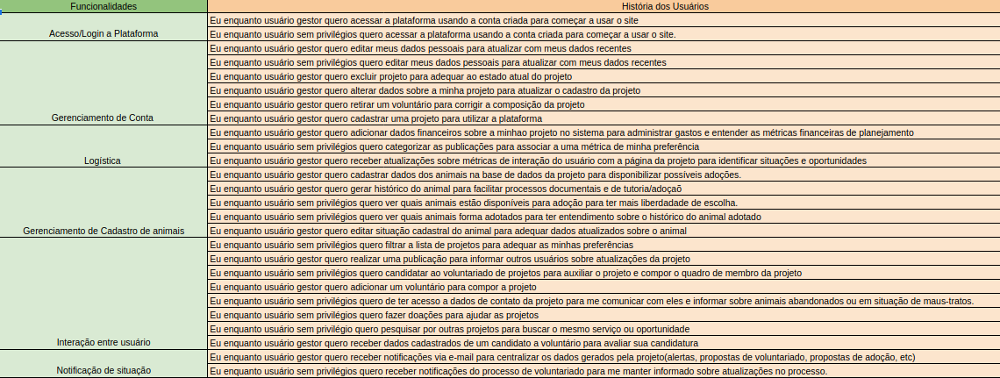

# Backlog

## Histórico de Versão

|    Data    | Versão |             Descrição              |            Autor(es)             |
| :--------: | :----: | :--------------------------------: | :------------------------------: |
| 18/07/2022 |  0.1   |        Criação do documento        |   Pedro Helias, Rhuan, Daniel    |
| 18/07/2022 |  0.2   | Alteração nas histórias de usuário |      Pedro Helias. Gabriel       |
| 13/08/2022 |  0.3   |        Organizando backlog         | Pedro Helias e Gabriel Marcolino |

## Backlog do Produto

A partir do levantamento do requisitos, foi construída uma estrutura com a organização proposta pela SAFe para definir o Backlog do Produto. 

Temos então como Épicos e Funcionalidades:

Já como as histórias do usuário associadas a suas funcionalidades, temos:

Abaixo o documento é descrito para melhor visualização:

|                         US |                                |
| -------------------------: | :----------------------------- |
|              **Descrição** | **Eu como** **quero** **para** |
|                 **Pontos** |                                |
| **Critérios de aceitação** |                                |

## **Épico-01: Sessão do Usuário**

### **FT01 - Acesso/Login a Plataforma**

#### US01

|                       US01 |                                                                                                                 |
| -------------------------: | :-------------------------------------------------------------------------------------------------------------- |
|              **Descrição** | **Eu como** dono do projeto **quero** acessar a plataforma usando a conta criada **para** começar a usar o site |
|                 **Pontos** | -                                                                                                               |
| **Critérios de aceitação** | -                                                                                                               |
 
#### US02

|                       US02 |                                                                                                            |
| -------------------------: | :--------------------------------------------------------------------------------------------------------- |
|              **Descrição** | **Eu como** voluntário **quero** acessar a plataforma usando a conta criada **para** começar a usar o site |
|                 **Pontos** | -                                                                                                          |
| **Critérios de aceitação** | -                                                                                                          |

#### US03

|                       US03 |                                                                                                       |
| -------------------------: | :---------------------------------------------------------------------------------------------------- |
|              **Descrição** | **Eu como** tutor **quero** acessar a plataforma usando a conta criada **para** começar a usar o site |
|                 **Pontos** | -                                                                                                     |
| **Critérios de aceitação** | -                                                                                                     |

### **FT02 - Gerenciamento de conta**

#### US04

|                       US04 | Editar dados pessoais                                                                                   |
| -------------------------: | :------------------------------------------------------------------------------------------------------ |
|              **Descrição** | **Eu como** dono do projeto **quero** editar meus dados pessoais **para** atualizar meus dados recentes |
|                 **Pontos** | -                                                                                                       |
| **Critérios de aceitação** | -                                                                                                       |

#### US05

|                       US05 | Editar dados pessoais                                                                              |
| -------------------------: | :------------------------------------------------------------------------------------------------- |
|              **Descrição** | **Eu como** voluntário **quero** editar meus dados pessoais **para** atualizar meus dados recentes |
|                 **Pontos** | -                                                                                                  |
| **Critérios de aceitação** | -                                                                                                  |

#### US06

|                       US06 | Editar dados pessoais                                                                         |
| -------------------------: | :-------------------------------------------------------------------------------------------- |
|              **Descrição** | **Eu como** tutor **quero** editar meus dados pessoais **para** atualizar meus dados recentes |
|                 **Pontos** | -                                                                                             |
| **Critérios de aceitação** | -                                                                                             |

#### US07

|                       US07 | Excluir projeto                                                                                  |
| -------------------------: | :----------------------------------------------------------------------------------------------- |
|              **Descrição** | **Eu como** dono do projeto **quero** excluir projeto **para** adequar ao estado atualdo projeto |
|                 **Pontos** | -                                                                                                |
| **Critérios de aceitação** | -                                                                                                |

#### US08

|                       US08 | Cadastrar um projeto                                                                                                       |
| -------------------------: | :------------------------------------------------------------------------------------------------------------------------- |
|              **Descrição** | **Eu como** dono do projeto **quero** realizar o cadastro de um projeto para ter mais controle de gerenciamento e recursos |
|                 **Pontos** | -                                                                                                                          |
| **Critérios de aceitação** | - Só será realizado o cadastro caso o usuário possua 18 anos ou mais.                                                      |

#### US09

|                       US09 |                                                                                                        |
| -------------------------: | :----------------------------------------------------------------------------------------------------- |
|              **Descrição** | **Eu como** dono do projeto **quero** retirar um voluntário **para** corrigir a composição do  projeto |
|                 **Pontos** |                                                                                                        |
| **Critérios de aceitação** |                                                                                                        |

#### US10

|                       US10 | Realizar cadastro de um projeto                                                                                            |
| -------------------------: | :------------------------------------------------------------------------------------------------------------------------- |
|              **Descrição** | **Eu como** dono do projeto **quero** realizar o cadastro de um projeto para ter mais controle de gerenciamento e recursos |
|                 **Pontos** | 0                                                                                                                          |
| **Critérios de aceitação** | - Só será realizado o cadastro caso o usuário possua 18 anos ou mais.                                                      |

### **FT03 - Logística**

#### US11

|                       US11 |                                |
| -------------------------: | :----------------------------- |
|              **Descrição** | **Eu como** **quero** **para** |
|                 **Pontos** |                                |
| **Critérios de aceitação** |                                |

#### US12

|                       US12 |                                |
| -------------------------: | :----------------------------- |
|              **Descrição** | **Eu como** **quero** **para** |
|                 **Pontos** |                                |
| **Critérios de aceitação** |                                |

#### US13

|                       US13 |                                |
| -------------------------: | :----------------------------- |
|              **Descrição** | **Eu como** **quero** **para** |
|                 **Pontos** |                                |
| **Critérios de aceitação** |                                |

#### US14

|                       US14 |                                |
| -------------------------: | :----------------------------- |
|              **Descrição** | **Eu como** **quero** **para** |
|                 **Pontos** |                                |
| **Critérios de aceitação** |                                |

## **Épico-02: Interatividade com o sistema**

### **FT04 - Gerenciamento de cadastro de animais**

#### US15

|                       US15 | Realizar cadastro do animal                                                                                              |
| -------------------------: | :----------------------------------------------------------------------------------------------------------------------- |
|              **Descrição** | **Eu como** dono do projeto **quero** realizar o cadastro do animal **para** facilitar a busca dos usuários para adoções |
|                 **Pontos** | 0                                                                                                                        |
| **Critérios de aceitação** | - Exibir uma mensagem após a finalização do cadastro                                                                     |

#### US16

|                       US16 | Gerar histórico do animal                                                                                          |
| -------------------------: | :----------------------------------------------------------------------------------------------------------------- |
|              **Descrição** | **Eu como** dono do projeto **quero** gerar histórico do animal **para** facilitar processos documentais de adoção |
|                 **Pontos** |                                                                                                                    |
| **Critérios de aceitação** |                                                                                                                    |

#### US17

|                       US17 | Exibir animais disponíveis para adoção                                                                                   |
| -------------------------: | :----------------------------------------------------------------------------------------------------------------------- |
|              **Descrição** | **Eu como** tutor **quero** quero ver quais animais estão disponíveis para adoção **para** ter mais liberdade de escolha |
|                 **Pontos** |                                                                                                                          |
| **Critérios de aceitação** |                                                                                                                          |

#### US18

|                       US18 | Filtrar os tipos de animais/raça                                                                      |
| -------------------------: | :---------------------------------------------------------------------------------------------------- |
|              **Descrição** | **Eu como** tutor **quero** filtrar os tipos de animais/raças **para** escolher um animal para adoção |
|                 **Pontos** |                                                                                                       |
| **Critérios de aceitação** |                                                                                                       |

#### US19

|                       US19 |                                |
| -------------------------: | :----------------------------- |
|              **Descrição** | **Eu como** **quero** **para** |
|                 **Pontos** |                                |
| **Critérios de aceitação** |                                |

#### US20

|                       US20 | Realizar a edição de informações do animal                                                                                                        |
| -------------------------: | :------------------------------------------------------------------------------------------------------------------------------------------------ |
|              **Descrição** | **Eu como** dono do projeto **quero** realizar edição de informações do animal **para** ter maior controle sobre os animais vinculados ao projeto |
|                 **Pontos** | 0                                                                                                                                                 |
| **Critérios de aceitação** |                                                                                                                                                   |
  
### **FT05 - Interação entre usuário**

#### US21

|                       US21 | Filtrar a pesquisa de projetos por preferências pessoais                                                                             |
| -------------------------: | :----------------------------------------------------------------------------------------------------------------------------------- |
|              **Descrição** | **Eu como** voluntário **quero** filtrar a pesquisa de projetos por referências pessoais **para** ter maior simplicidade no processo |
|                 **Pontos** | 0                                                                                                                                    |
| **Critérios de aceitação** |                                                                                                                                      |

#### US22

|                       US22 | Realizar cadastro para adoção do animal                                                             |
| -------------------------: | :-------------------------------------------------------------------------------------------------- |
|              **Descrição** | **Eu como** tutor **quero** realizar cadastro do animal **para** ter maior simplicidade no processo |
|                 **Pontos** | 0                                                                                                   |
| **Critérios de aceitação** |                                                                                                     |

#### US23

|                       US23 | Realizar publicação de post                                                                                                 |
| -------------------------: | :-------------------------------------------------------------------------------------------------------------------------- |
|              **Descrição** | **Eu como** dono do projeto **quero** realizar a publicação de um post **para** facilitar a busca dos usuários para adoções |
|                 **Pontos** | 0                                                                                                                           |
| **Critérios de aceitação** |                                                                                                                             |

#### US24

|                       US24 |                                |
| -------------------------: | :----------------------------- |
|              **Descrição** | **Eu como** **quero** **para** |
|                 **Pontos** |                                |
| **Critérios de aceitação** |                                |

#### US25

|                       US25 |                                |
| -------------------------: | :----------------------------- |
|              **Descrição** | **Eu como** **quero** **para** |
|                 **Pontos** |                                |
| **Critérios de aceitação** |                                |

#### US26

|                       US26 |                                |
| -------------------------: | :----------------------------- |
|              **Descrição** | **Eu como** **quero** **para** |
|                 **Pontos** |                                |
| **Critérios de aceitação** |                                |

#### US27

|                       US27 |                                |
| -------------------------: | :----------------------------- |
|              **Descrição** | **Eu como** **quero** **para** |
|                 **Pontos** |                                |
| **Critérios de aceitação** |                                |

#### US28

|                       US28 |                                |
| -------------------------: | :----------------------------- |
|              **Descrição** | **Eu como** **quero** **para** |
|                 **Pontos** |                                |
| **Critérios de aceitação** |                                |

#### US29

|                       US29 |                                |
| -------------------------: | :----------------------------- |
|              **Descrição** | **Eu como** **quero** **para** |
|                 **Pontos** |                                |
| **Critérios de aceitação** |                                |

#### US30

|                       US30 | Realizar pesquisa de um projeto                                                                       |
| -------------------------: | :---------------------------------------------------------------------------------------------------- |
|              **Descrição** | **Eu como** voluntário **quero** realizar a pesquisa de um projeto **para** ajudar causas importantes |
|                 **Pontos** |                                                                                                       |
| **Critérios de aceitação** |                                                                                                       |

#### US31

|                       US31 |                                |
| -------------------------: | :----------------------------- |
|              **Descrição** | **Eu como** **quero** **para** |
|                 **Pontos** |                                |
| **Critérios de aceitação** |                                |

#### US32

|                       US32 | Realizar pesquisa de documentos                                                                                    |
| -------------------------: | :----------------------------------------------------------------------------------------------------------------- |
|              **Descrição** | **Eu como** dono do projeto **quero** realizar a pesquisa de documento **para** utilizar dados armazenados no site |
|                 **Pontos** | 0                                                                                                                  |
| **Critérios de aceitação** |

#### US33

|                       US33 |                                |
| -------------------------: | :----------------------------- |
|              **Descrição** | **Eu como** **quero** **para** |
|                 **Pontos** |                                |
| **Critérios de aceitação** |                                |

### **FT06 - Notificação de situação**				

#### US34

|                       US34 |                                |
| -------------------------: | :----------------------------- |
|              **Descrição** | **Eu como** **quero** **para** |
|                 **Pontos** |                                |
| **Critérios de aceitação** |                                |

#### US35

|                       US35 |                                |
| -------------------------: | :----------------------------- |
|              **Descrição** | **Eu como** **quero** **para** |
|                 **Pontos** |                                |
| **Critérios de aceitação** |                                |

#### US36

|                       US36 |                                |
| -------------------------: | :----------------------------- |
|              **Descrição** | **Eu como** **quero** **para** |
|                 **Pontos** |                                |
| **Critérios de aceitação** |                                |
  												
O documento foi construído numa planilha de Excel virtual, presente no link abaixo. 

<a href="https://docs.google.com/spreadsheets/d/1EftTSPJfwSpOPxZRh9l8VIjlzVJ5hROlLfbYlBwVJSs/edit?usp=sharing">Backlog</a>  
  

