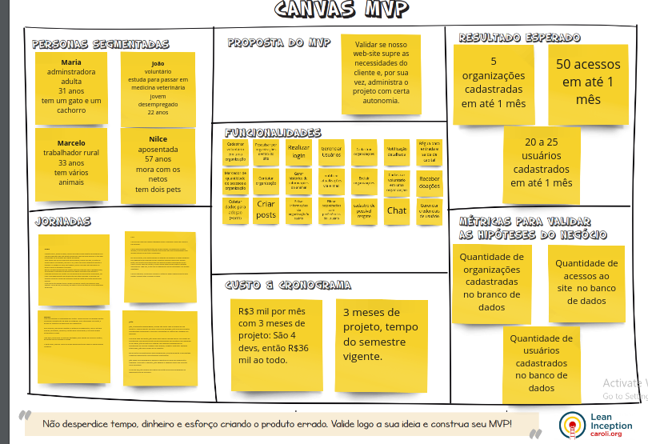

# Canvas MVP

## Histórico de Versão

|    Data    | Versão |             Descrição              |                         Autor(es)                         |
| :--------: | :----: | :--------------------------------: | :-------------------------------------------------------: |
| 18/07/2022 |  0.1   |        Criação do documento        | Pedro Helias, Rhuan, Gabriel Marcolino, Jefferson, Daniel |
| 21/07/2022 |  0.2   |       Correção do documento        |                       Pedro Helias                        |
| 28/07/2022 |  0.3   |      Atualização do documento      |             Gabriel Marcolino e Pedro Helias              |
| 09/08/2022 |  0.4   | Movendo o MVP para outro documento |                     Gabriel Marcolino                     |

## Canvas MVP 

O Canvas MVP realizado encontrasse no link abaixo. Neste quadro feito no site Miro, encontra-se também o levantamento de requisitos solicitado pelo professor para realização de atividade em sala. 
Novamente, recomenda-se que para uma maior visualização, acesse o link abaixo.

<a href="https://miro.com/app/board/uXjVOms21R0=/?share_link_id=395701300927">Canvas MVP</a>

