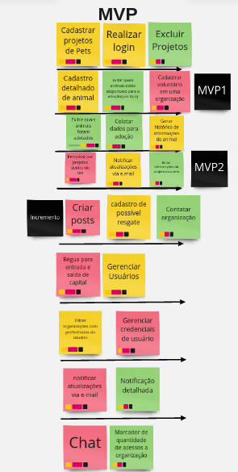

# Requisitos e Canvas MVP

## Histórico de Versão

|    Data    | Versão |      Descrição       |  Autor(es)   |
| :--------: | :----: | :------------------: | :----------: |
| 18/07/2022 |  0.1   | Criação do documento | Pedro Helias, Rhuan, Gabriel Marcolino, Jefferson, Daniel |
| 21/07/2022 |  0.1   | Correção do Documento | Pedro Helias |

## Requisitos Funcionais e Não Funcionais

Em uma sessão de Brainstorming, foram levantadas algumas ideias a respeito do que estaria presente no site, seja como funcionalidade, seja como regras específicas, diretrizes, métricas, entre outros. Após esse passo, as ideias foram filtradas e novamente avaliadas, e por fim reestruturadas. Com esses novos pontos, definimos então os Requisitos Funcionais e Não Funcionais. Entende-se como requisitos funcionais tudo o que o sistema vai fazer, como possíveis funcionalidades; e Não Funcionais como diretrizes a se seguir, ou regras específicas. Abaixo encontra-se os requisitos definidos:

Para os Requisitos Funcionais, foram adicionadas Tags referentes a prioridade inicialmente imaginada para os requisitos definidos. As tags da cor preta referem-se a prioridade "alta", algo que imaginamos que, se concluídos, representará uma parte funcional do que foi idealizado. Já as tags da cor laranja/vermelha, prioridade "média" descreve alguns diferenciais que a plataforma vai conter. Por fim, os requisitos tagados com a cor amarela representam algumas ideias que foram validadas mas devido a um semestre com período reduzido, foram ideias identificadas como prioridade baixa. 

Para os Requisitos Não Funcionais, foram adicionadas Tags representando o tipo de Requisito Não Funcional. No nosso projeto, constam requisitos do tipo Organizacional, de Usabilidade, de suportabilidade, alguns relacionados a desempenho e outros a segurança. Fora algumas métricas para implementação. 

Recomenda-se que para uma melhor visualização, acesse o
<a href="https://miro.com/app/board/uXjVOms21R0=/?share_link_id=395701300927">link</a>

## Canvas MVP 

O Canvas MVP realizado encontrasse no link abaixo. Neste quadro feito no site Miro, encontra-se também o levantamento de requisitos solicitado pelo professor para realização de atividade em sala. 
Novamente, recomenda-se que para uma maior visualização, acesse o link abaixo.

<a href="https://miro.com/app/board/uXjVOms21R0=/?share_link_id=395701300927">Canvas MVP</a>

