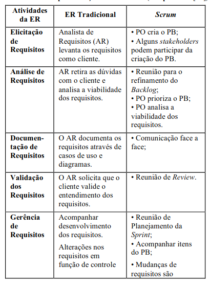

# Visão do Produto e Projeto
## Histórico de Versão

|    Data    | Versão |                            Descrição                            |                    Autor(es)                    |
| :--------: | :----: | :-------------------------------------------------------------: | :---------------------------------------------: |
| 23/06/2022 |  0.1   |                      Criação do documento                       |                  Pedro Helias                   |
| 25/06/2022 |  0.2   |                     Visão geral do projeto                      |        Gabriel Marcolino e Rhuan Marques        |
| 28/06/2022 |  0.3   |                     Visão geral do produto                      |            Pedro Helias e Jefferson             |
| 28/06/2022 |  0.4   |              Processo de engenharia de requisitos               | Gabriel Marcolino, Pedro Helias e Rhuan Marques |
| 29/06/2022 |  0.5   | Tecnologias Utilizadas, Processo de desenvolvimento de software |          Matheus, José, Renan, Shaíne           |
| 29/06/2022 |  0.6   |             Processo de desenvolvimento de software             |          Matheus, José, Renan, Shaíne           |
| 03/07/2022 |  1.0   |               Correções do documento - Requisitos               |                 Pedro e Gabriel                 |

## Sumário
## 1. Visão Geral do Produto

A _Pets Off Road_ é uma organização fundamentada e gerida em grupos de _Whatsapp_ que visa, principalmente, auxiliar animais desamparados, que estão em situação de rua, sofrem maus tratos ou foram abandonados. A organização deixa claro que não é um abrigo para animais, mas sim uma causa composta por colaboradores que conseguem auxiliar o projeto da forma como podem, seja carona, lar temporário, entre outros. Cada colaborador se estabelece em um grupo o qual consegue auxiliar no projeto relacionado. É citado os grupos de Castração de animais de Rua, Auxílio a Zoonose do Valparaíso, Projeto de Resgate, o que sempre está precisando de novos colaboradores e mais recentemente o Grupo Teen que trabalha na construção de casinhas para animais de rua. A _Pets Off Road_ possui páginas em redes sociais, onde muito dos trabalhos de comunicação são realizados, além de ser uma ponte entre quem pode ajudar e o projeto.

* O produto proposto se trata de uma solução WEB (um website) que visa criar uma estrutura mais robusta e virtualizada de alguns serviços que a _Pets Off Road_ presta atualmente, ou seja, evoluir os meios de gerência e acessibilidade para os projetos, de forma a adaptar o que já é feito atualmente, seja com cadastros virtuais, listagem de componentes, até a criação de uma “ponte” entre a Pets Off Road e o usuário/colaborador.

* O produto possui origem acadêmica voltado a uma causa admirável, além de que se busca propor uma solução baseada no que já se configura na questão de gerência e fluxo de serviço. Em outras palavras, busca-se respeitar o que já existe e adaptar em uma solução mais dinâmica e robusta.

* Os usuários alvo são: Pessoas dispostas a adotar animais, realizar doações(remédio, pix) e/ou colaborar com a _Pets Off Road_. O cliente é a criadora da _Pets Off Road_.

* Atualmente, as operações realizadas são feitas via _Instagram_. A princípio, apenas essa plataforma consegue suprir o alcance do projeto, porém não supre as necessidades gerenciais e de controle. A cliente relata que possui bastante dificuldade para controlar e filtrar candidatos a voluntariado e/ou tutores de animais, além de que a gestão de dados também não é simplificada. Portanto, o produto visa a resolução dessas problemáticas expostas.

### 1.1. Declaração de Posição do Produto

| Para             | Usuários em comum                                                                                                                                                                                                                   |
| ---------------- | ----------------------------------------------------------------------------------------------------------------------------------------------------------------------------------------------------------------------------------- |
| Quem             | Deseja realizar doações, adoção de animais e/ou voluntariado                                                                                                                                                                        |
| A _Pet Off Road_ | É um projeto em vias de migração para um Website                                                                                                                                                                                    |
| Que              | Disponibiliza informações para doações, formulários de cadastro para voluntários/tutores, histórico de cuidado com o animal, entre outros                                                                                           |
| Ao Contrário     | De procurar por informação em diversos posts da página oficial do projeto no _Instagram_, onde a cliente fica à mercê da orgarnização do APP                                                                                        |
| Nosso produto    | Condensará boa parte das atividades e informações que não estão presentes ou acessíveis no _Instagram_, ou são improváveis de serem executadas por lá, como gerência de informação, gestão e filtragem de voluntários, entre outros |

### 1.2. Objetivos do Produto

O principal objetivo é facilitar algumas tarefas realizadas pela organização, Pets Off Road, no dia-a-dia, já que normalmente todas as tarefas são feitas através do whatsapp e Instagram, redes sociais não muito adequadas para as resoluções dos serviços realizados.

Para ajudar na administração e gerenciamento das tarefas criaremos um website. Nele será possível que qualquer pessoa possa realizar seu cadastro, se tornar um voluntário e escolher quais grupos irá fazer parte, deixaremos disponíveis dados da organização para que doações possam ser feitas, também ficará disponível dados dos médicos parceiros e petshops que ajudam os animais quando precisam ser castrados e por fim será possível detalhar os eventos da Pets Off Road. E para a cliente, um backgroud onde será possível gerenciar e filtrar cadastros realizados por terceiros.

### 1.3. Tecnologias a Serem Utilizadas

Os desenvolvedores da Pets Off Road decidiram usar algumas tecnologias que já estão familiarizados, consequentemente, o tempo que terão para se dedicarem a escalada do projeto será maior. São elas:

| Frontend                                            | Backend                                       | Teste                            | Prototipação                    | Comunicação | Organizacional |
| --------------------------------------------------- | --------------------------------------------- | -------------------------------- | ------------------------------- | ----------- | -------------- |
| [ReactJs](https://reactjs.org/) (JavaScript Libary) | [NodeJS](https://nodejs.org)                  | [Jest](https://jestjs.io/pt-BR/) | [Figma](https://www.figma.com/) | Discord     | Github         |
| [TypeScript](https://www.typescriptlang.org/)       | [MySQL](https://dev.mysql.com/doc/)           |                                  |                                 | Meet        | Miro           |
| [Styled-Components](https://styled-components.com/) | [TypeScript](https://www.typescriptlang.org/) |                                  |                                 | Whatsapp    |                |

 
  
  
  
  
  
  
  

## 2. Visão Geral do Projeto
### 2.1. Organização do Projeto

|         Papel         |                                                                                           Atribuições                                                                                            |            Responsável             |                          Participantes                           |
| :-------------------: | :----------------------------------------------------------------------------------------------------------------------------------------------------------------------------------------------: | :--------------------------------: | :--------------------------------------------------------------: |
|     Desenvolvedor     |                                                              Codificar o produto, codificar testes unitários, realizar refatoração                                                               | Renan Rodrigues e Matheus Phillipo | Renan Rodrigues, Shaine Aparecida, Jose Filipi, Matheus Phillipo |
| Analista de Qualidade |                          Elaboração e implementação de modelos e ferramentas de controle de qualidade, com foco na adoção de políticas e técnicas de melhoria contínua.                          |         Gabriel Marcolino          | Jefferson Franca, Gabriel Marcolino, Rhuan Marques, Pedro Helias |
|     Product Owner     | Construir, aperfeiçoar e manter o Backlog, assegurar que o mesmo esteja visível, claro e transparente para todos, assim como o objetivo do produto, solicitar a implementação de funcionalidades |            Pedro Helias            | Jefferson Franca, Gabriel Marcolino, Rhuan Marques, Pedro Helias |
|     Scrum Master      |                              Responsável por garantir que os rituais do Scrum sejam seguidos, age como um facilitador das dailys, sprint reviews e sprint planning                               |           Rhuan Marques            | Jefferson Franca, Gabriel Marcolino, Rhuan Marques, Pedro Helias |
|        Cliente        |                                              Administradora do projeto __Pets Off Road__ e responsável por validar os pontos de entrega do projeto                                               |      Marcela Carvalho Marques      |                     Marcela Carvalho Marques                     |

### 2.2. Planejamento das Fases e/ou Iterações do Projeto

|  Sprint   |                    Produto (Entrega)                    | Data Início |  Data Fim  |
| :-------: | :-----------------------------------------------------: | :---------: | :--------: |
| Sprint 1  |                  Definição do Projeto                   | 21/06/2022  | 28/06/2022 |
| Sprint 2  |               Levantamento de Requisitos                | 30/06/2022  | 07/07/2022 |
| Sprint 3  | MVP1 + Desenvolvimento de Protótipo de Baixa Fidelidade | 08/07/2022  | 15/07/2022 |
| Sprint 4  |                           --                            | 16/07/2022  | 23/07/2022 |
| Sprint 5  |                           --                            | 25/07/2022  | 01/08/2022 |
| Sprint 6  |                           --                            | 02/08/2022  | 09/08/2022 |
| Sprint 7  |                           --                            | 10/08/2022  | 17/08/2022 |
| Sprint 8  |                           --                            | 18/08/2022  | 25/08/2022 |
| Sprint 9  |                           --                            | 26/08/2022  | 02/09/2022 |
| Sprint 10 |                           --                            | 03/09/2022  | 10/09/2022 |
| Sprint 11 |                           --                            | 12/09/2022  | 19/09/2022 |

### 2.3. Matriz de Comunicação 

|                               Descrição                               |       Área/Envolvidos        |     Periodicidade     |           Produtos Gerados           |
| :-------------------------------------------------------------------: | :--------------------------: | :-------------------: | :----------------------------------: |
|              Acompanhamento das Atividades em Andamento               |      Equipe do Projeto       |        Semanal        |            Ata da reunião            |
| Acompanhamento dos Riscos, Compromissos, Ações Pendentes, Indicadores |     Equipe de Requisitos     |       Quinzenal       |            Ata da reunião            |
|                     Comunicar Situação do Projeto                     | Equipe do Projeto, Professor |        Semanal        |         Feedback do projeto          |
|                      Comunicação geral do grupo                       |      Equipe do Projeto       | Sempre que necessário |            Ata da reunião            |
|                         Reunião com a cliente                         |     Equipe de Requisitos     |       Quinzenal       | Ata da reunião e feedback do projeto |

### 2.4. Gerenciamento de Riscos

Para o gerenciamento de riscos devem ser realizadas tarefas como: 

* Identificar todos os riscos possíveis e detectáveis em cada fase do projeto;  

* Executar as ações para mitigar os riscos que tenham um alto grau de exposição ao risco caso este ocorra na Lista de Riscos do Projeto;

* Fazer uma revisão da lista dos riscos periodicamente, com o propósito de averiguar uma possível incidência de um risco e ver se há outros riscos ainda não relatados;

* Em caso de confirmação de um risco previsto, agir no sentido de contingenciá-lo conforme programado;

* Registrar os riscos no Painel de Controle do Projeto e no Plano do Projeto (Riscos iniciais).

|                    Risco                    |                                                                      Descrição                                                                       | Probabilidade |                                                   Ações de Mitigação                                                   |
| :-----------------------------------------: | :--------------------------------------------------------------------------------------------------------------------------------------------------: | :-----------: | :--------------------------------------------------------------------------------------------------------------------: |
|  Dificuldade no desenvolvimento do sitema   |                           Falta de experiência da equipe responsável com as tecnologias utilizadas, complexidade da tarefa                           |     Alta      |                           Pareamento com uma pessoa mais experiente e buscar ajuda externa.                            |
| Algum membro da equipe trancar a disciplina |         As atividades da pessoa em questão terão que ser repassadas, dificultando o andamento do projeto e sobrecarga nos membros restantes          |     Baixa     |                        Replanejamento das atividades e reatribuição para os membros restantes.                         |
|        Baixa produtividade da equipe        |                                   Falta de disponibilidade de tempo, membro da equipe adoecer, falta de motivação                                    |     Alta      |            Replanejar as atividade e redistribuí-las para que o andamento do projeto não seja prejudicado.             |
|      Problema de comunicação da equipe      | Má interpretação das atividades, não atuação por efeitos externos(falta de internet, queda de energia, queda de algum meio de comunicação da equipe) |   Moderada    |                            Procurar outros meios de comunicação, reatribuir as atividades.                             |
|              Mudança de escopo              |                            A escolha do tema não agrade os membros da equipe ou a proposta seja rejeitada pelo professor                             |     Baixa     |                           Reordenação dos elementos existentes e criação de um novo escopo.                            |
|     A cliente sai ou desiste do projeto     |               Como a Marcela é a unica cliente e principal responsável pelo projeto isso iria impossibilitar a continuação do projeto                |     Alto      | Mudança do escopo do projeto ou expandir o projeto para que atenda os mesmos problemas de outras organizações/projetos |
|             Cliente fica doente             |                                 A cliente fica doente dificultando a comunicação e a partifipação dela nas reuniões                                  |   Moderado    |                                          Replanejar as atividades ou adia-las                                          |

### 2.5. Critérios de Replanejamento

Com base nos riscos do projeto foram estabelecidos os seguintes critérios de replanejamento:

* Mudança nos requisitos;
* Algum membro da equipe sair;
* Algum membro ficar doente;
* Atrasos no cronograma do projeto;

## 3. Processo de Desenvolvimento de Software

O ciclo de vida escolhido foi o evolutivo por alguns fatores levantados utilizando a tabela de seleção baseadas no status do time de desenvolvimento e participação do usuário. A equipe está tendo contato constante com o cliente, tendo possiblidade de receber feedbacks e realizar melhorias em tempo hábil. Além disso, a escolha do ciclo de vida foi impactada pelos seguintes itens:

- Desenvolvedores com experiências distintas que não envolvem o escopo do projeto;
- Time de desenvolvimento com nível Trainee - Junior e com disponibilidade para aprendizado autodidata;
- O cliente não participa de todas as etapas do desenvolvimento;
- Participação limitada do cliente;
- Cliente não tem total domínio do problema;

Com isso, optamos por uma abordagem ágil utilizando uma metodologia baseada em Scrum contendo práticas do XP, pois definimos anteriormente que o escopo de trabalho seria fracionado e cada parte desenvolvida em ciclos. Com etapas mais curtas e entregas mais frequentes, aliviaríamos a carga de trabalho e diminuindo os erros através de feedbacks constantes do cliente e do time de requisitos. Tornado-se um ambiente dinâmico e o aprendizado da equipe acelerado, impulsionando a produtividade em relação ao andamento do projeto.
  
### 3.1. Análise/Design

|                 Atividade                  |         Método         | Ferramenta |            Entrega            |
| :----------------------------------------: | :--------------------: | :--------: | :---------------------------: |
| Produção de protótipos de média fidelidade |  Utilização do Figma   |   Figma    | Protótipo de média fidelidade |
|           Refinamento do projeto           | Padrões de Codificação |   Figma    | Protótipo de média fidelidade | --------------------------- |

### 3.2. Construção

|          Atividade           |               Método                |            Ferramenta             |      Entrega      |
| :--------------------------: | :---------------------------------: | :-------------------------------: | :---------------: |
| Desenvolvimento de Back-End  | Abstração do Problema e Codificação |     Node.js, Nest.Js e ESLint     |      Backend      |
| Desenvolvimento de Front-end | Abstração do problema e codificação |    ReactJS, Styled-Components     |     Frontend      |
|    Integração da solução     |       Versionamento de código       |           Git & Github            | Solução integrada |
|   Implementação da solução   |        Hospedagem da solução        | Firebase/ Heroku/ Netlify/ Vercel |      Deploy       |

### 3.3.  Teste

|         Atividade          |                            Método                            |    Ferramenta     |              Entrega               |
| :------------------------: | :----------------------------------------------------------: | :---------------: | :--------------------------------: |
|   Criar casos de testes    | Discussão para definir as especificações dos casos de testes | Discord e VS code | Especificações dos casos de testes |
| Produção de scripts testes |                         Codificação                          |       Jest        |          Script de Testes          |
|     Validar a Solução      |                         Codificação                          |      VS code      |        Componentes testados        |

## 4. Processo de Engenharia de Requisitos

A equipe do projeto decidiu utilizar uma abordagem ágil para a Engenharia de Requisitos(ER), tendo em vista as necessidades do time e do cliente. Em uma abordagem aǵil as atividades específicas da ER não são especificadas/explicitas. Assim, no contexto ágil o responsável pela gerencia dos requisitos é o PO.  Além disso, a metodogia ágil conta com a criação do backlog do produto, em que será listado todos os requisitos. Como o desenvolvimento é dividido em *Sprints*, os requisitos não terão necessidade de serem detalhados logo no início do projeto, e sim quando forem movidos para o *Sprint Backlog*.

### 4.1. Elicitação de Requisitos

FAZER ISSO

|               Atividade               |                                                                    Descrição                                                                    |        Método        | Ferramenta  |            Entrega             |
| :-----------------------------------: | :---------------------------------------------------------------------------------------------------------------------------------------------: | :------------------: | :---------: | :----------------------------: |
| Elucidar ideias e analisar o problema | Reunião com a equipe de requisitos com o objetivo de retirar a maior quantidade de "funcionalidades" do diagrama de projetos da _Pets Off Road_ |      Brainstorm      | Miro e Meet |           imagens 1            |
|  Entender as necessidades do cliente  |            Reunião com a cliente para validação dos pontos previamente levantados na atividade anterior, e abertura de novos pontos             | Brainstorm e Reunião | Miro e Meet |            imagem 2            |
|    Definir proposta de Requisitos     |                  Reunião após contato com a cliente, para solidificar a proposta de requisitos apresentada na primeira entrega                  |       Reunião        |    Meet     | Fechamento da primeiro entrega |

  

### 4.2. Análise de Requisitos

|            Atividade            |                                                                Método                                                                | Ferramenta  |          Entrega          |
| :-----------------------------: | :----------------------------------------------------------------------------------------------------------------------------------: | :---------: | :-----------------------: |
| Definir o website com o cliente | Maturação dos pontos levantados anteriormente a reunião com a cliente, desenvolvimento de proposta de projeto juntamente do cliente. | Miro e Meet | Mural com funcionalidades |

### 4.3. Documentação de Requisitos

|                      Atividade                      |                      Método                      | Ferramenta  |           Entrega           |
| :-------------------------------------------------: | :----------------------------------------------: | :---------: | :-------------------------: |
| Definição de Requisitos Funcionais e Não Funcionais | Técnicas de Registro e Organização de Requisitos | Meet e Miro | Especificação de Requisitos |

### 

### 4.4. Verificação e Validação de Requisitos

|                Atividade                 |                                                                                                   Método                                                                                                    | Ferramenta |                                                       Responsáveis                                                       |                   Entrega                   |
| :--------------------------------------: | :---------------------------------------------------------------------------------------------------------------------------------------------------------------------------------------------------------: | :--------: | :----------------------------------------------------------------------------------------------------------------------: | :-----------------------------------------: |
| Conferir se os requisitos estão corretos | Conferir se os requisitos estão corretos a partir de validação baseada em teste de aceitação. Os critérios são: validação por parte da cliente e coerência com os testes técnicos realizados posteriormente |    Meet    | Equipe de projetos: responsável por realizar testes técnicos; Cliente: Responsável por validar os requisitos levantados. | Integralização de funcionalidades aprovadas |

### 4.5. Gerenciamento de Requisitos

|                Atividade                |  Método  |   Ferramenta   |           Entrega           |
| :-------------------------------------: | :------: | :------------: | :-------------------------: |
| Acompanhamento e Refinamento do backlog | Reuniões | Meet e Discord | detalhamento dos requisitos |

## 5. Lições Aprendidas

### 5.1. Unidade 1
#### 5.1.1. MDS 

#### 5.1.2. Requisitos
Aprendemenos que um bom produto requer um contato recorrente com o cliente, além da verificação e manutenabilidade dos requisitos definidos para o projeto. 
Apesar dos conhecimentos obtidos, a construção do documento de Engenharia de Requisitos foi complexa e necessitou de revisões e reformulações.
Também tivemos dificuldade na comunicação pela indisponibilidade de tempo relacionadas ao trabalho, cursos e/ou outras disciplinas, porém resolvido posteriormente.
#### 5.1.3. MDS-Requisitos

### 5.2. Unidade 2
#### 5.2.1. MDS 
#### 5.2.2. Requisitos
#### 5.2.3. MDS-Requisitos

### 5.3. Unidade 3
#### 5.3.1. MDS 
#### 5.3.2. Requisitos
#### 5.3.3. MDS-Requisitos

### 5.4. Unidade 4
#### 5.4.1. MDS 
#### 5.4.2. Requisitos
#### 5.4.3. MDS-Requisitos

##  6. Referências Bibliográficas

1. Sommerville, I., Engenharia de software. 9th ed., Pearson Addison Wesley, 2011
2. Silveira, Bárbara; Werneck, Marcelo. A Engenharia de Requisitos nos métodos ágeis: uma revisão sistemática da literatura. 2017
3. Ciclos de Vida do Software. Disponível em: <https://www.devmedia.com.br/ciclos-de-vida-do-software/21099> Acesso em 29 jun. 2022
4. Alves, Lucas; Metodologia Scrum: entenda as etapas e funções dentro da gestão de projetos ágeis; 19 nov. 2011 Disponível em: <https://www.take.net/blog/chatbots/metodologia-scrum/> Acesso em 29 jun. 2022.
5. Paixão, Marina; Metodologia Scrum: tudo o que você precisa para não atrasar seus projetos; 06 jul. 2021 Disponível em: <https://www.witix.com.br/blog-postagens/9/metodologia-scrum-tudo-o-que-voce-precisa-para-nao-atrasar-seus-projetos> Acesso em 03 jun. 2022.
