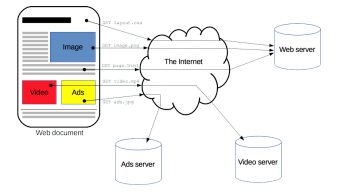
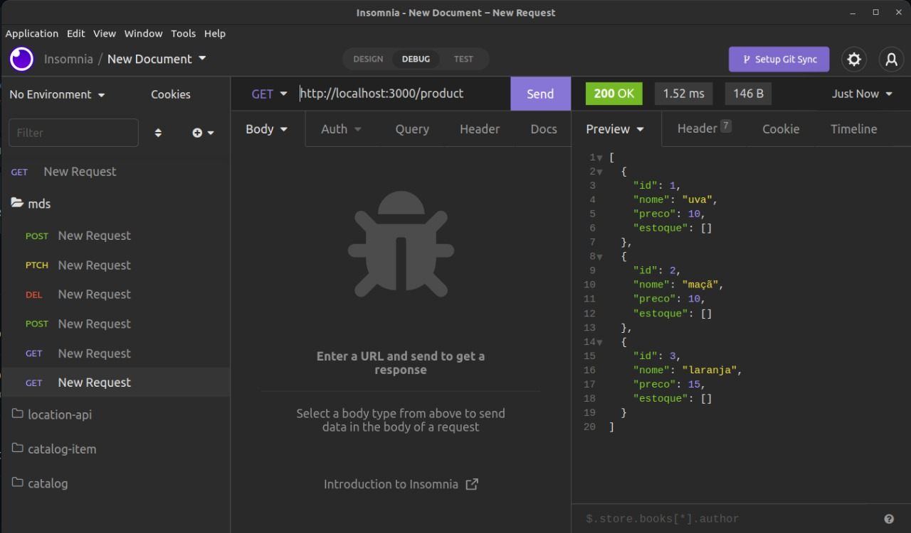
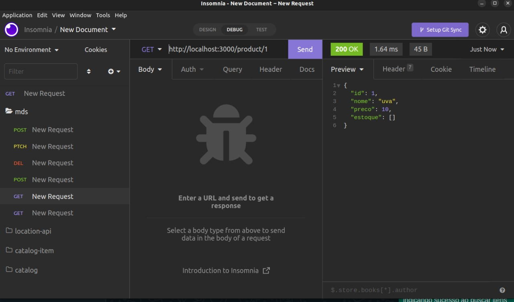
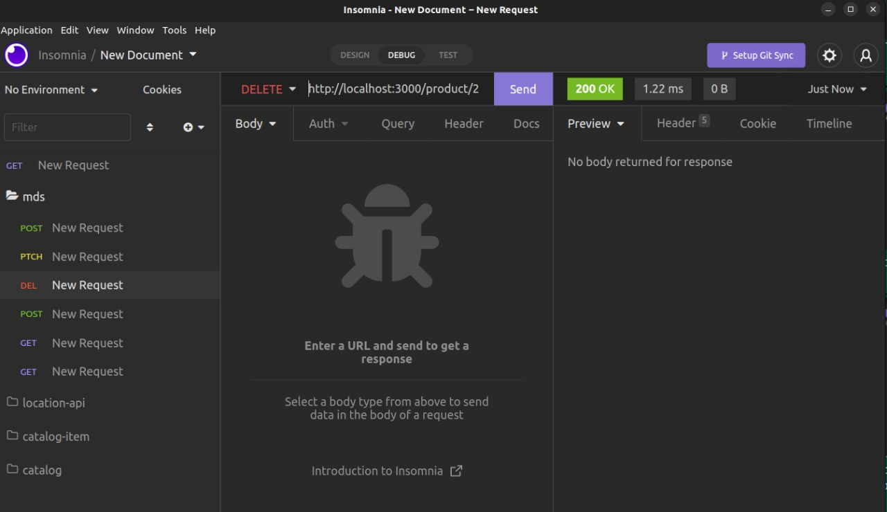

## Histórico de Versão

| Data | Versão | Descrição | Autor |
|--------|-----------|---------------|---------|
| 18/07/2022 | 0.1 | Criação do documento | Shaíne, Renan, José  e Matheus|
| 21/07/2022 | 0.2 | Entrega do documento | Shaíne, Renan, José  e Matheus|

# Desenvolvedores

Renan Rodrigues

# Colaboradores

José Filipi, Shaíne Oliveira, Matheus Phillipo

# Conteúdo

Construção de api's com framework nestJs e comunicação de microsserviços.

# Nest.js e Microsserviços

NestJS é um framework de Node.js orientado a
aplicações do lado do servidor (server-side), utilizando como base
servidores HTTP como Express e Fastify. Dessa forma o desenvolvimento
pode ser feito de maneira eficiente e escalável.

## O que são Microsserviços

Microsserviços são uma abordagem de arquitetura de software, onde o
software consiste em pequenos serviços independentes que se comunicam
usando APIs bem definidas. Dentre as vantagens desse tipo de abordagem
é possível citar:

▶ Facilitam a escalabilidade e diminuem o tempo de desenvolvimento de
aplicações.

▶ Simplificam o processo de atualização de recursos de acordo com a
demanda do uso dos serviços.

▶ Habilitam a inovação rápida e diminuem a possibilidade de falhas e
bugs da aplicação, uma vez que cada serviço possui autonomia de
funcionamento.

## Como funciona o HTTP

▶ Ao digitar uma URL em um navegador web é realizada uma conexão
com o servidor correspondente para a recuperação do IP.

▶ Após isso, a requisição HTTP é feita ao servidor, caso a página exista,
a resposta será seu próprio conteúdo, caso o servidor não encontre a
página será retornado o Erro HTTP 404 (página não encontrada).

▶ Por fim, a conexão com servidor é finalizada e a resposta é exibida no
navegador para o usuário que realizou a requisição.

## Códigos de resposta HTTP

▶ Códigos 20X: Estes códigos estão relacionados ao sucesso da
requisição,porém o significado do sucesso varia de acordo com o
método solicitado,como é feito pelo código 201 (Created), que
retorna como resposta a criação de um novo recurso no servidor após
uma requisição de método POST.

▶ Códigos 40X: Códigos exibidos para resultados onde não foi possível
concluir a requisição por erros ligados ao lado do usuário, como por
exemplo o clássico Erro 404 (Página não encontrada).

▶ Códigos 50X: Códigos exibidos para resultados onde não foi possível
concluir a requisição por erros ligados ao lado do servidor,
representado por exemplo pelo Erro 502 (Bad Gateway).

## Primeiros passos

Para o workshop, é necessário verificar se o computador contêm o [Node.js](https://nodejs.org/en/) e o [Insomnia](https://insomnia.rest/download) instalados. 

Você pode checar na sua máquina se tem o Node instalado, abrindo o terminal digitando:

`node --version`

`npm --version`

PS: É recomendável ter a versão estável mais recente, podendo checar no próprio site  https://nodejs.org/en/

. Clone o repositório do workshop em https://github.com/LacerdaRenan/api-nest-mds

. Inicialize projeto nas máquinas com os comandos 'npm install', 'npm start'

## Objetivos

Entender o que significam os HTTP codes e aplicá-los, Construir e consumir API's para entender como funciona o processo básico de backend. 

Ao final do workshop, você será capaz de:

. Consumir apis disponíveis e verificar os respectivos HTTP codes.

. Verificar erros implantados em APIs e tentar fazer a correção.

## Exercícios

Realizar requisições HTTP nos seguintes endereços

### get http://localhost:3000/product 
  Requisição para buscar todos produtos
  
 
### get http://localhost:3000/product/id
  Requisição para buscar produtos by id

### post http://localhost:3000/product, Body dto {"nome": "string", "preco": 10}
  Requisição para cadastro de produto

### patch http://localhost:3000/product/id Body dto {"nome": "string", "preco": 10}
  Requisição para atualização de produto

### delete patch http://localhost:3000/product/id
  Requisição para deleção de produto by id

### Resultados Esperados

#### Exemplo de requisição post com status code 201 indicando que houve criação de item com sucesso

#### Exemplo de requisição get com status code 200 indicando sucesso ao buscar itens

#### Exemplo de requisição get com parâmetro id indicado na url. status code 200 indicando sucesso

#### Exemplo de requisição delete com parâmetro id indicado na url

#### Exemplo de requisição patch com parametro id indicado na url

# Referência

[Documentação do Nestjs](https://docs.nestjs.com/), acessado em https://docs.nestjs.com/

[W3 Schools](https://w3schools.com), acessado em https://w3schools.com/.